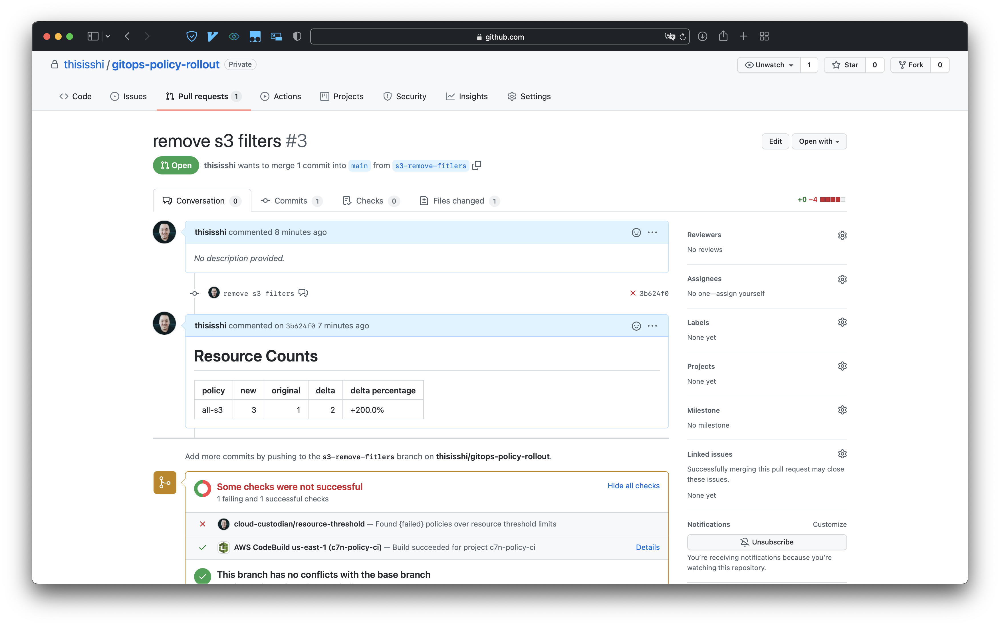

# Safe Policy Rollouts with GitOps
KubeCon 2021 - Governance as Code Day with Cloud Custodian hosted by Stacklet



## Installation

To install, first generate a Github personal access token with access to the repos
that you want to run CI on. Then, run the following commands:

```bash
cd deploy
terraform init
cp settings.tfvars.example settings.tfvars
# Edit the settings.tfvars file, all vars can be found in deploy/vars.tf
terraform apply -var-file=settings.tfvars
```

This project uses [c7n-policystream](https://cloudcustodian.io/docs/tools/c7n-policystream.html)
to detect changes between your commit and the base branch, as defined by `base_branch`. The
CodeBuild job then runs the changed policies as well as the original ones from `base_branch`
and compares the results of the two. You can also specify thresholds for the job to fail on,
with values for both total number of resources (e.g. if the delta is 5 resources for a given
policy, fail) or for a percentage (e.g. if the delta in percentage is greater than 50% fail).
